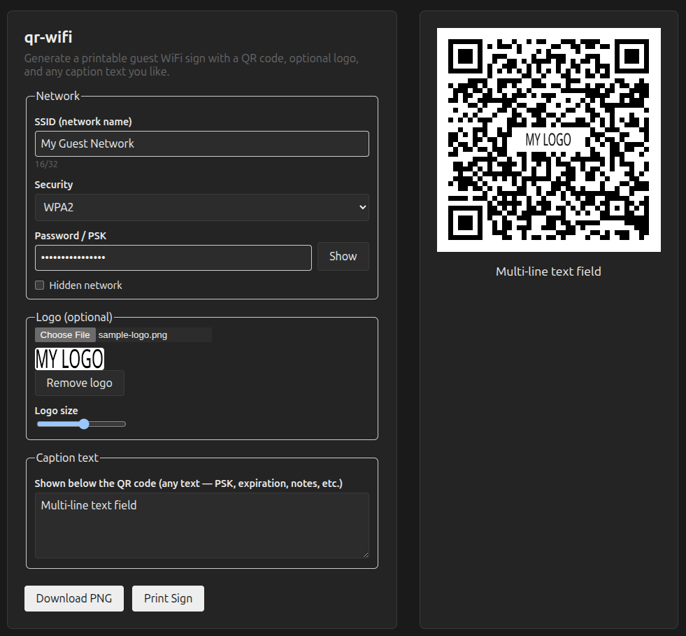

# qr-wifi

A free, open-source, client-side tool for generating printable guest WiFi
signs: a scannable WiFi QR code, an optional embedded logo, and any caption
text you like below it (PSK, expiration date, notes, etc.).

No backend, no build step, no tracking — everything runs in your browser.
The app is more than one file (`index.html` plus its `css/`, `js/`, and
`vendor/` folders), so grab the whole repo rather than saving just the HTML
page, then open `index.html` directly or serve the folder as a static site.

## Usage

1. Get the files — either:
   - Clone the repo: `git clone https://github.com/daxm/qr-wifi.git`, or
   - Download the ZIP (no git required): use the green **Code** button at
     the top of the [GitHub repo page](https://github.com/daxm/qr-wifi) →
     **Download ZIP**, then unzip it.
2. Open `index.html` in a browser (works offline, including via `file://`
   — no server needed).
3. Fill in the SSID, security type, and password.
4. Optionally upload a logo — the slider controls how much of the QR code it
   covers. Keep it under ~25% or the code may stop scanning reliably; test
   with your phone before printing. Don't have a logo handy? Try
   [`assets/sample-logo.png`](assets/sample-logo.png) to see how it looks.
5. Add any caption text you'd like shown below the code.
6. Click **Download PNG** to save an image, or **Print Sign** to print
   directly from the browser (use "Save as PDF" in the print dialog for a
   PDF file).

## License

MIT — see [LICENSE](LICENSE). Uses the vendored
[qr-code-styling](https://github.com/kozakdenys/qr-code-styling) library
(MIT) — see [THIRD_PARTY_LICENSES.md](THIRD_PARTY_LICENSES.md).
